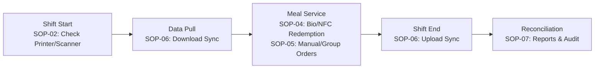

# AGC Canteen POS System — Standard Operating Procedures (SOPs)

This directory contains the operational Standard Operating Procedures (SOPs) for the **AGC Canteen POS System**. These documents establish standardized protocols across device lifecycle, hardware maintenance, daily meal operations, enrollment, data sync, and reconciliation.

---

## 📑 SOP Catalog Index

| Document | Title | Primary Role | Operational Phase |
|:---|:---|:---|:---|
| [SOP-01](./SOP-01_Terminal_Provisioning_and_Setup.md) | Terminal Provisioning & Kitchen Setup | IT Support / Admin | Deployment / Onboarding |
| [SOP-02](./SOP-02_Peripheral_Management_and_Calibration.md) | Peripheral Management (Printer, Scanner & NFC) | IT Support / Supervisor | Setup / Daily Opening |
| [SOP-03](./SOP-03_Staff_Biometric_and_NFC_Enrollment.md) | Staff Biometric & NFC Credential Enrollment | Canteen Admin / HR | Credential Management |
| [SOP-04](./SOP-04_Daily_Meal_Voucher_Redemption.md) | Daily Meal Voucher Redemption (Bio & NFC) | POS Cashier / Operator | Daily Peak Service |
| [SOP-05](./SOP-05_Manual_Alacarte_and_Group_Orders.md) | Manual, À La Carte & Group Order Processing | POS Cashier / Operator | Daily Peak Service |
| [SOP-06](./SOP-06_Offline_Operations_and_Data_Sync.md) | Offline Mode & Data Synchronization | Cashier / Supervisor / IT | Continuity & Shift Close |
| [SOP-07](./SOP-07_Reconciliation_Reporting_and_Troubleshooting.md) | Reconciliation, Reports & Fault Troubleshooting | Supervisor / IT Support | Shift Closing & Support |

---

## 👥 Role & Responsibility Matrix

```
┌────────────────────────────────────────────────────────────────────────────────────────┐
│                                 ROLES & RESPONSIBILITIES                               │
├───────────────────────┬─────────────────────────────────┬──────────────────────────────┤
│ ROLE                  │ PRIMARY FOCUS                   │ ASSIGNED SOPS                │
├───────────────────────┼─────────────────────────────────┼──────────────────────────────┤
│ IT Support / SysAdmin │ Hardware, Pairing, Provisioning │ SOP-01, SOP-02, SOP-06, SOP-07│
│ Canteen Admin / HR    │ Staff Data, Biometrics, Badging │ SOP-01, SOP-03, SOP-06       │
│ Canteen Supervisor    │ Daily Operations, Shifts, Audit │ SOP-02, SOP-06, SOP-07       │
│ POS Cashier / Operator│ Meal Redemption, Orders, Vouchers│ SOP-04, SOP-05, SOP-06       │
└───────────────────────┴─────────────────────────────────┴──────────────────────────────┘
```

---

## 🔄 Daily Operational Lifecycle


